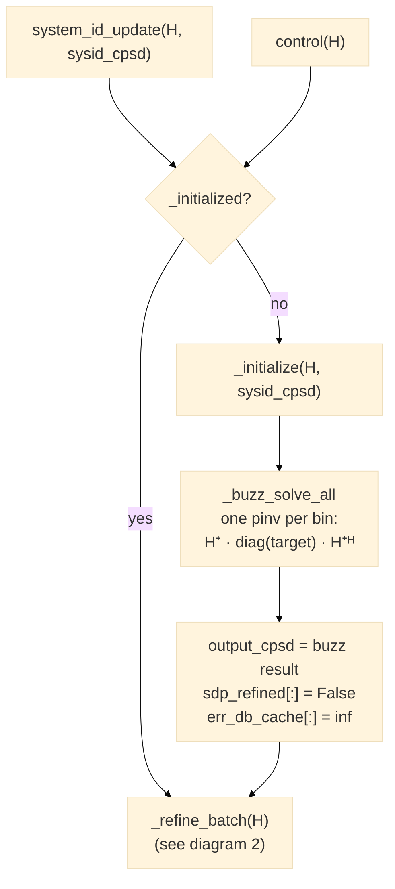
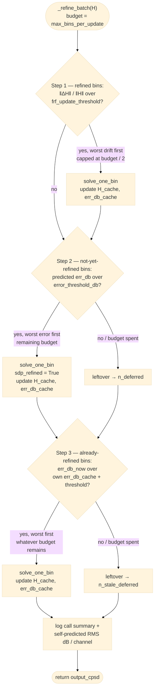
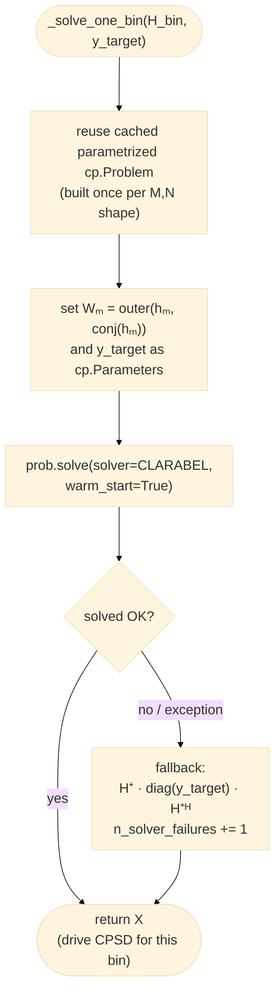

<title>Optimal Diagonal Control Flow</title>

# `optimal_diagonal_control.py` — control flow

Current state of [control_laws/optimal_diagonal_control.py](control_laws/optimal_diagonal_control.py):
a buzz baseline covers every bin instantly, then a budgeted three-step
scheduler spends `max_bins_per_update` SDP solves per call, all backed by
a single cached SDP problem that's re-solved (not rebuilt) per bin.

Split into three diagrams below — entry/init, the per-call scheduler, and
the shared per-bin solver — so each one renders large enough to read.

---

## 1. Entry points and one-time initialization

**Entry-point asymmetry:** `system_id_update()` passes the real survey CPSD
into `_initialize` on the first call, so buzz's cross terms come from
measured coherence/phase (`_match_coherence_phase`). `control()`'s first
call passes `sysid_cpsd=None` — if *it* ends up being the one that
initializes, buzz starts diagonal-only (zero cross terms) until the next
`system_id_update()` call.

---

## 2. `_refine_batch` — the per-call scheduler

Runs on every subsequent `system_id_update()` / `control()` call, spending
up to `max_bins_per_update` SDP solves total across three steps, in order:

- **Step 1's cap at half the budget** stops persistent (or noise-driven)
  FRF jitter on already-refined bins from starving Step 2's coverage of
  bins that have never been refined at all.
- **Step 2** is the main progressive-coverage pass — it's what lets
  control start on call 1 with a full-spectrum buzz-quality result instead
  of waiting for one giant up-front solve.
- **Step 3 compares each bin to its *own* cached error, not the absolute
  `error_threshold_db`.** Many bins (e.g. near a structural null) can
  never get under that absolute floor no matter how many times they're
  re-solved — comparing to it directly would burn the whole step's budget
  forever on unfixable bins instead of catching bins that genuinely got
  worse since their last solve. This step only spends budget Steps 1–2
  didn't use, so it never slows a fresh start's convergence; it's the only
  route back to re-optimization once every bin has been refined at least
  once (Step 2 stops running when `n_deferred` hits 0).

---

## 3. `_solve_one_bin` — shared by all three steps

`H` can't be a `cp.Parameter` directly — `diag(H X Hᴴ)` is bilinear in `H`
(it appears on both sides of the variable `X`), which isn't
DPP-affine-in-parameter. Reformulating each response channel's diagonal
term as a linear functional of `X` (precomputing `Wₘ` in plain numpy per
bin) sidesteps that, letting the same `cp.Problem` be reused across every
bin solve instead of rebuilt from scratch each time — this plus the
CLARABEL solver swap is what gave the ~6-7x SDP speedup logged in
`examples/sixdrive12resp/results/frf_averaging_and_allmodes_study_2026-08-14.txt`
(Part F).

---

## Parameter reference

| Parameter | Default | Role |
|---|---|---|
| `reg` | `1e-6` | Tikhonov weight on `‖X‖_F` in the SDP objective |
| `frf_update_threshold` | `0.05` | Relative `‖ΔH‖` that triggers Step 1's drift re-solve |
| `max_bins_per_update` | `20` | Total SDP solves per call, split across Steps 1–3 |
| `error_threshold_db` | `1.0` | Step 2's refine-worthiness bar; also the *margin* Step 3 checks against each bin's own cached error |
| `max_drive_coherence` | `0.95` | Cap on pairwise drive coherence in SDP-refined bins (`1.0` disables it) |
